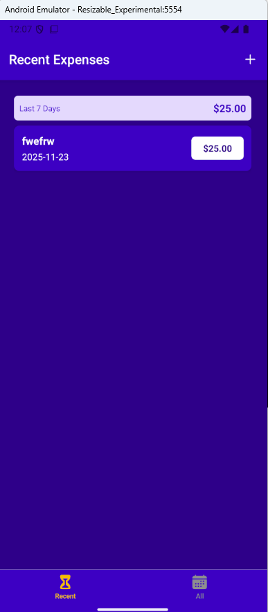
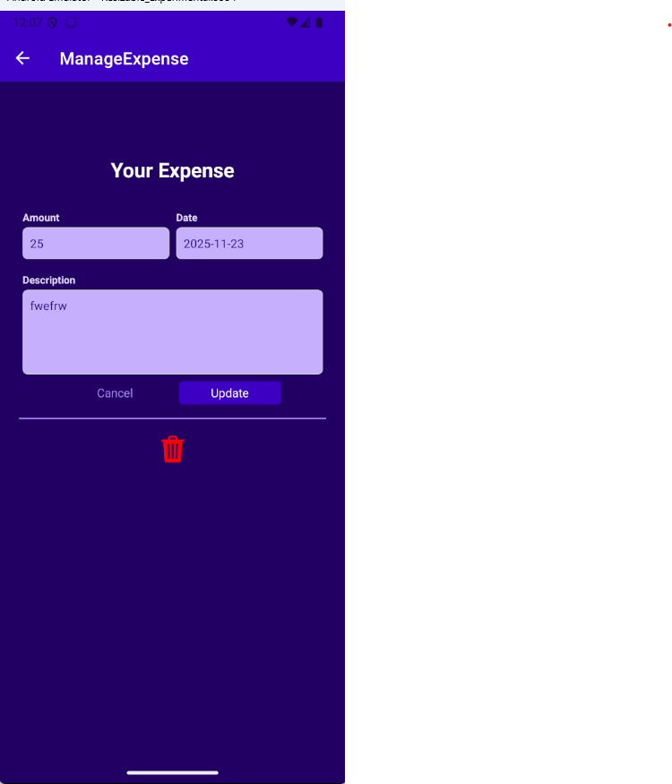

# 📱 ExpenseTracker — React Native

<div align="center">


**A modern, intuitive mobile expense tracking application built with React Native and Firebase**

[Features](#-features) • [Installation](#️-installation) • [Usage](#-usage) • [API](#-api-functions) • [Contributing](#-contributing)

</div>

---

## 📖 Overview

ExpenseTracker is a clean and efficient mobile application designed to help users manage their personal finances effortlessly. Built with React Native and powered by Firebase Realtime Database, this app provides a seamless experience for tracking daily expenses with real-time data synchronization across devices.

### ✨ Why ExpenseTracker?

- **Real-timeSync**: All data is instantly synchronized with Firebase
- **User-Friendly**: Intuitive interface designed for quick expense entry
- **Reliable**: Secure cloud storage ensures your data is never lost
- **Cross-Platform**: Works seamlessly on both iOS and Android devices

---

## 🚀 Features

✅ **Add Expenses** — Quickly log new expenses with amount, description, and date  
✅ **Edit Expenses** — Update existing expense details anytime  
✅ **Delete Expenses** — Remove unwanted entries with a single tap  
✅ **View All Expenses** — Browse through your complete expense history  
✅ **Real-time Database** — Firebase integration for instant data sync  
✅ **Automatic Date Formatting** — Clean and readable date display  
✅ **Modular Architecture** — Well-organized code structure for easy maintenance  
✅ **Responsive UI** — Beautiful design that works on all screen sizes  

---

## 🛠 Tech Stack

### **Frontend**
- **React Native** — Cross-platform mobile framework
- **JavaScript (ES6+)** — Modern JavaScript syntax
- **React Navigation** — For seamless screen transitions

### **Backend & Database**
- **Firebase Realtime Database** — NoSQL cloud database
- **Axios** — Promise-based HTTP client for API calls

### **Tools & Libraries**
- **Expo** (optional) — Development and build toolchain
- **React Context API / Redux** — State management

---

## 📂 Project Structure

```
ExpenseTracker/
│
├── components/              # Reusable UI components
│   ├── ExpenseForm.js
│   ├── ExpenseItem.js
│   └── ExpenseList.js
│
├── screens/                 # Application screens
│   ├── ManageExpense.js
│   ├── RecentExpenses.js
│   └── AllExpenses.js
│
├── store/                   # State management (Context/Redux)
│   └── expenses-context.js
│
├── util/                    # Utility functions
│   ├── http.js             # Firebase API calls
│   └── date.js             # Date formatting helpers
│
├── App.js                   # Main application entry point
├── package.json             # Dependencies and scripts
└── README.md                # Project documentation
```

## ⚙️ Installation

### Prerequisites

- Node.js (v14 or higher)
- npm or yarn
- Expo CLI (optional, for Expo projects)
- Android Studio / Xcode (for native development)

### Setup Steps

1. **Clone the repository**
   ```bash
   git clone https://github.com/PandyaRaj/ExpenseTracker.git
   cd ExpenseTracker
   ```

2. **Install dependencies**
   ```bash
   npm install
   # or
   yarn install
   ```

3. **Configure Firebase**
   - Update `util/http.js` with your Firebase database URL

4. **Start the development server**

   **Using Expo:**
   ```bash
   npx expo start
   ```

   **Using React Native CLI:**
   ```bash
   # For Android
   npx react-native run-android

   # For iOS
   npx react-native run-ios
   ```

---
## 📱 Usage

### Adding an Expense
1. Tap the **"+"** button
2. Enter the amount, description, and date
3. Tap **"Add"** to save

### Editing an Expense
1. Tap on any expense from the list
2. Modify the details
3. Tap **"Update"** to save changes

### Deleting an Expense
1. Tap on the expense you want to remove
2. Tap the **"Delete"** button
3. Confirm the deletion

---

## 📸 Screenshots

<div align="center">

| Home Screen | Manage Expense | 
|-------------|-------------|
|  |  

</div>
---

## 👨‍💻 Author

**Raj Pandya**

- GitHub: [@PandyaRaj](https://github.com/PandyaRaj)
- LinkedIn: [Raj Pandya](https://www.linkedin.com/in/pandya-raj-8346001b4)

---
<div align="center">

### ⭐ Star this repo if you found it helpful!

**Made with ❤️ by Raj Pandya**

</div>
